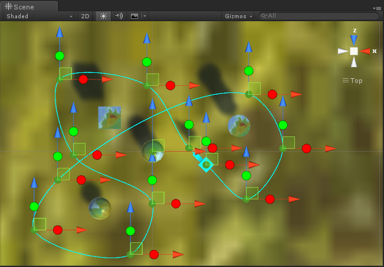

# MGS-PathAnimation
- [中文手册](./README_ZH.md)

## Summary
- Unity plugin for make path animation in scene.

## Demand
- Create path curve by anchors.
- Play animation base on path curve.

## Environment
- Unity 5.0 or above.
- .Net Framework 3.0 or above.

## Achieve
- Path£ºCreate path curve for animation.
- PathAnimation£ºPlay animation base on path curve.
- VectorAnimationCurve£ºDefine 3D curve for path.
- PathEditor£ºEdit anchors of path.
- PathAnimationEditor£ºAlign the animation gameobject to the start point of path curve.

## Demo
- Demos in the path "MGS-PathAnimation/Scenes" provide reference to you.

## Preview
- PathEditor

## Contact
- If you have anny questions, fell free to contact me at mogoson@qq.com.
