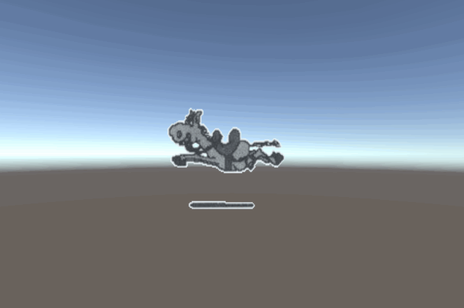
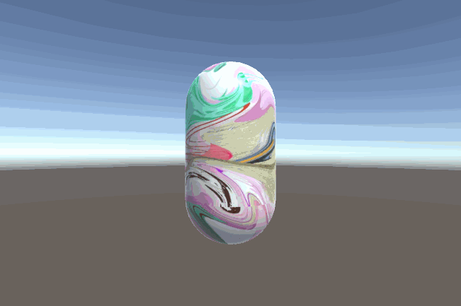
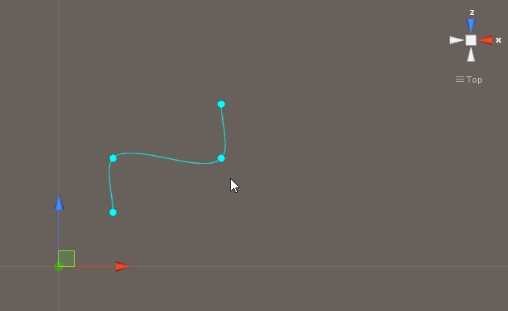

# MGS-Animation

## Summary
- Unity plugin for make animation in scene.

## Demand
### TwoDAnimation
- Frames animation display base on Mesh Renderer.
- Frames animation display base on Sprite Renderer.
- Frames animation display base on UI component(Image, RawImage).
- Frames(an image) animation display base on Mesh Renderer.
- UV offset animation display base on Mesh Renderer.
- Play local gif animation.

### PathAnimation
- Create path base on curve.
- Play animation base on path curve.

## Environment
- Unity 5.0 or above.
- .Net Framework 3.5 or above.

## Achieve
### TwoDAnimation
- ImgFramesAnimation: Sequence frames animation base on Image.
- RFramesAnimation: Sequence frames animation base on Renderer.
- RIFramesAnimation: Sequence frames animation base on RawImage.
- SRFramesAnimation: Sequence frames animation base on SpriteRenderer.
- UVFramesAnimation: Sequence frames animation base on UV offset.
- UVAnimation: Animation base on UV offset.

### PathAnimation
- BezierCurve : Define BezierCurve.
- HermiteCurve : Hermite curve in three dimensional space.
- EllipseCurve : Ellipse curve.
- HelixCurve : Helix curve.
- SinCurve : Sin curve.
- CurvePath : Define path base on curve.
- BezierPath : Define path base on cubic bezier curve.
- HermitePath :  Define curve path base on hermite curve.
- CirclePath : Path base on circle curve.
- EllipsePath : Path base on ellipse curve.
- HelixPath : Path base on helix curve.
- SinPath : Path base on sin curve.
- CurvePathAnimation : Define animation base on curve path.

## Demo
- Demos in the path "MGS-Animation/Scenes" provide reference to you.

## Preview

### TwoDAnimation

- Renderer Frames

  

- UV Animation

  

- Gif Animation

  

### TwoDAnimation
- Bezier Path Editor

- Hermite Path Editor

- UI Animation

- Path Animation

## Contact
- If you have any questions, feel free to contact me at mogoson@outlook.com.