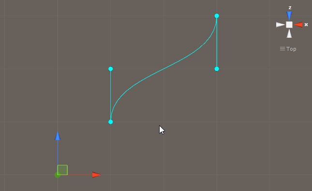
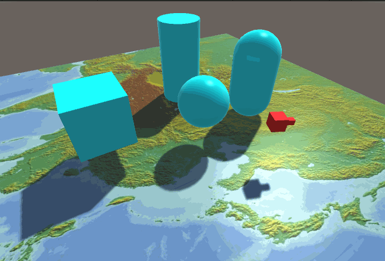

# MGS-PathAnimation
- [English Manual](./README.md)

## 概述
- Unity场景中制作路径动画插件包。

## 需求
- 锚点方式创建路径曲线。
- 基于路径曲线播放物体位移动画。

## 环境
- Unity 5.0 或更高版本。
- .Net Framework 3.0 或更高版本。

## 实现
- BezierCurve：贝塞尔曲线。
- HermiteCurve：分段三次埃尔米特曲线。
- EllipseCurve：椭圆曲线。
- HelixCurve：螺旋曲线。
- SinCurve：Sin曲线。

- CurvePath：曲线路径基类。
- BezierPath：贝塞尔曲线路径。
- HermitePath： 锚点曲线路径。
- CirclePath：圆形曲线路径。
- EllipsePath：椭圆曲线路径。
- HelixPath：螺旋曲线路径。
- SinPath：Sin曲线路径。

- CurvePathAnimation：曲线路径动画。

- GenericEditor：通用扩展编辑器。
- CurvePathEditor：曲线路径编辑器。
- BezierPathEditor：贝塞尔曲线路径编辑器。
- HermitePathEditor：锚点曲线路径编辑器。
- CurvePathAnimationEditor：曲线路径动画编辑器。

## 案例
- “MGS-PathAnimation/Scenes”目录下存有上述功能的演示案例，供读者参考。

## 预览
- Bezier Path Editor

- Hermite Path Editor

- UI Animation

- Path Animation

## 联系
- 如果你有任何问题或者建议，欢迎通过mogoson@outlook.com联系我。
